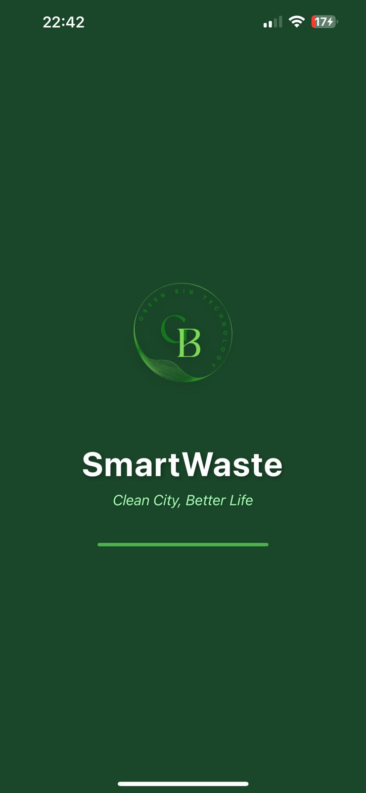
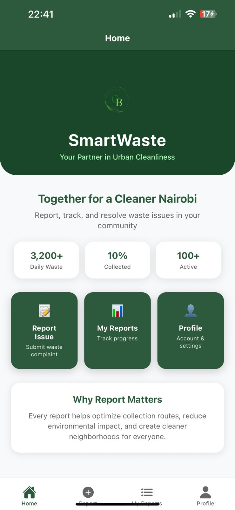
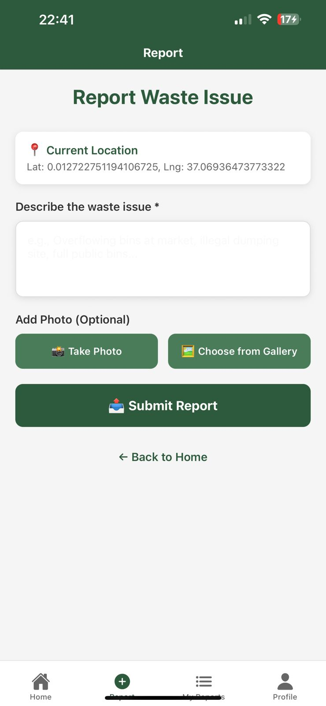
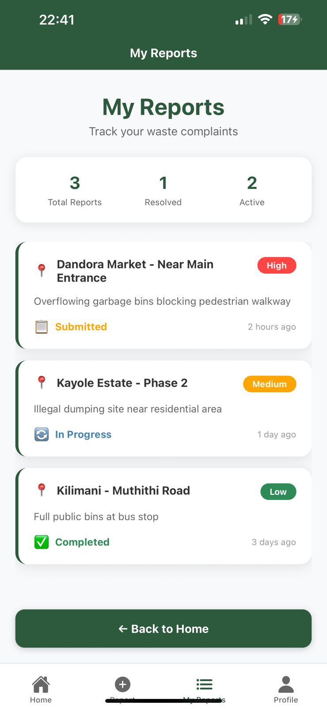
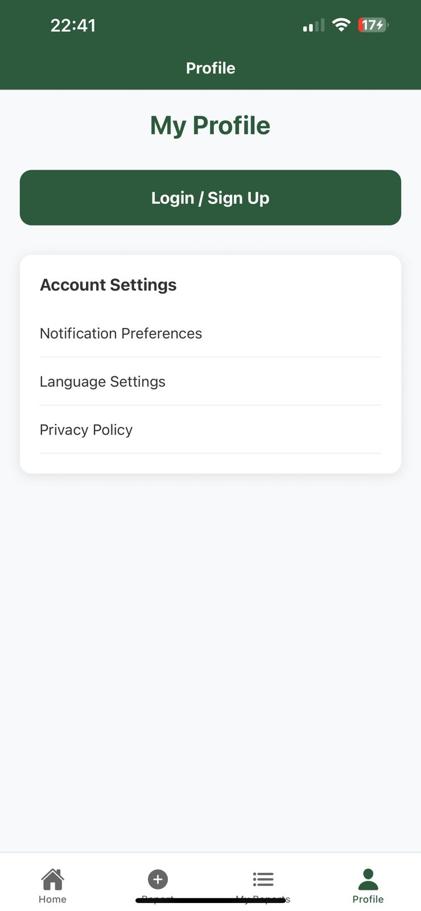
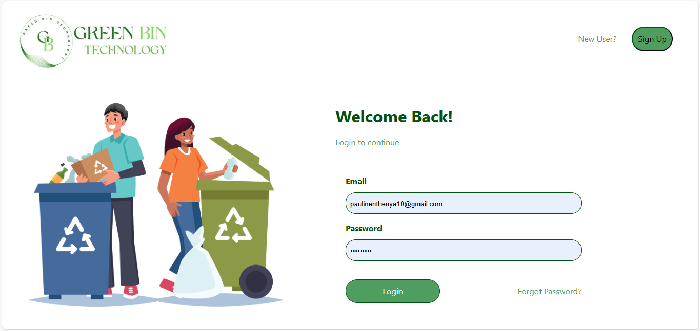
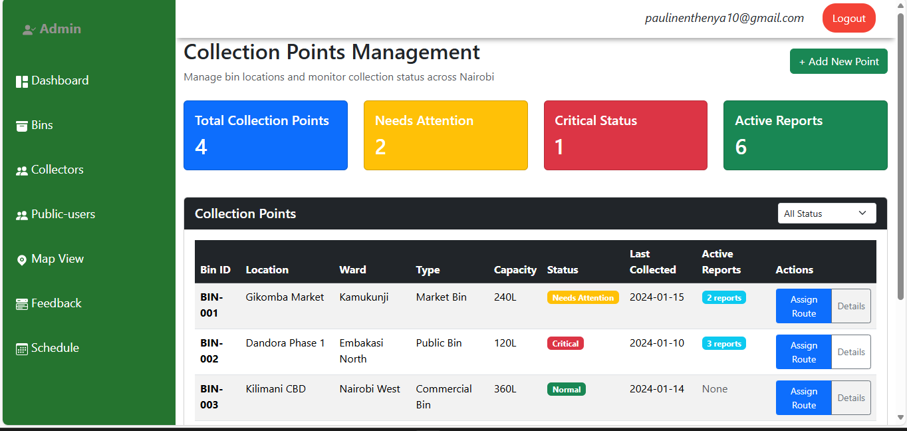
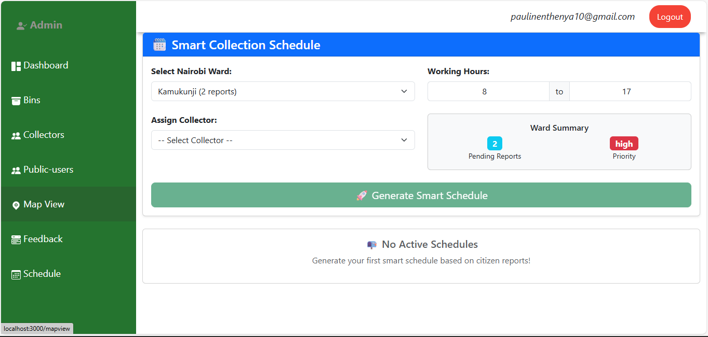

# SmartWaste Nairobi - Urban Waste Collection Optimization System

## 📱 Project Overview

SmartWaste Nairobi is a comprehensive full-stack solution designed to address Nairobi's urban waste management crisis. The system consists of a **citizen-facing mobile app** for real-time waste reporting and a **web dashboard** for waste management officials to coordinate collection efforts.

**GitHub Repository:** https://github.com/paulinemutuku/SmartWaste_Nairobi.git

## Features

### Mobile App (Citizen Platform)
- **Real-time waste reporting** with GPS location tracking
- **Photo evidence upload** for visual documentation
- **Report status tracking** with beautiful UI cards
- **Professional navigation** with bottom tab interface
- **User authentication** system ready for integration

### Web Dashboard (Administration Platform)
- **Report monitoring** and verification system
- **Route optimization** for collection vehicles
- **Real-time dashboard** with waste statistics
- **User management** for residents and collectors
- **Spatial clustering** of nearby reports (100-meter radius)

## 🛠️ Technology Stack

### Mobile Application
- **Frontend:** React Native with Expo Router
- **Navigation:** Expo Router with tab-based layout
- **Styling:** React Native StyleSheet
- **State Management:** React Hooks
- **Development:** Expo SDK

### Web Application
- **Frontend:** React.js with modern hooks
- **Backend:** Node.js with Express.js
- **Database:** MongoDB with Mongoose ODM
- **Authentication:** JWT-based security
- **API:** RESTful architecture

## ⚙️ Installation & Setup

### Prerequisites
- Node.js (v16 or higher)
- npm or yarn package manager
- MongoDB database
- Expo Go app (for mobile testing)

### Mobile App Setup
```bash
# Navigate to mobile app directory
cd SmartWaste_Mobile

# Install dependencies
npm install

# Start development server
npx expo start

# Scan QR code with Expo Go (Android) or Camera app (iOS)

## Web Frontend Setup

```bash
# Navigate to web frontend
cd SmartWaste_Web/frontend

# Install dependencies
npm install

# Start development server
npm start

# Application will open at http://localhost:3000
```

### Backend API Setup
```bash
# Navigate to backend
cd SmartWaste_Web/backend

# Install dependencies
npm install

# Start MongoDB service first
mongod

# Start development server (in a new terminal)
npm run dev

# API will run at http://localhost:5000
```

## 🎨 Designs & Screenshots

### Mobile Application
| Splash Screen | Landing Page | Report Waste |
|---------------|--------------|--------------|
|  |  |  |

| Status Tracking | Settings |
|-----------------|----------|
|  |  |

### Web Dashboard
| Login | Dashboard | Collection Points |
|-------|-----------|-------------------|
|  |  |  |

| Schedule Management |
|---------------------|
|  |

## 🚀 Deployment Plan

### Current Development Stage
- ✅ Mobile app frontend complete
- ✅ Web dashboard frontend complete  
- ✅ Backend API structure ready
- ✅ Database models defined
- 🔄 Backend integration in progress

### Next Phase Deployment
1. **Backend Integration** - Connect mobile/web to API
2. **Database Deployment** - MongoDB Atlas cloud database
3. **Mobile App** - Expo App Store deployment
4. **Web Dashboard** - Netlify hosting
5. **Backend API** - DigitalOcean

## 👥 Developer

**Pauline Mutuku**
```

